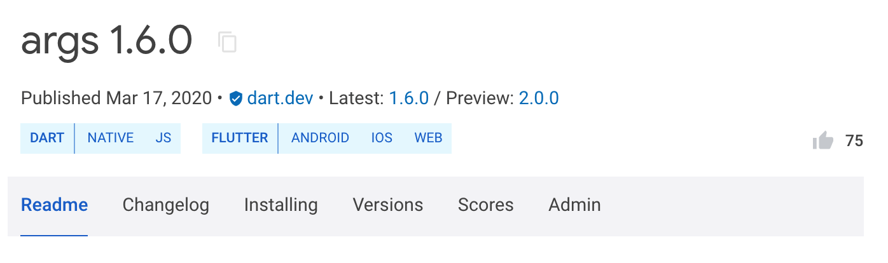

[The pub package manager][pub] isn't just for using other people's packages.
It also allows you to share your packages with the world. If you have a useful
project and you want others to be able to use it, use the `dart pub publish`
command.

[Pub package 管理工具][pub] 不但可以让你使用其他人开发的 package，
而且能向全世界分享你自己制作的 package。如果你有一个有用的项目，
且希望别人能够用到它，请使用 `dart pub publish` 命令。

{{site.alert.note}}

  To publish to a location other than pub.dev,
  or to prevent publication anywhere, use the `publish_to` field,
  as defined in the [pubspec][].

  发布到除 pub.dev 以外的其他位置，或者不在任何地方发布，
  使用 `publish_to` 参数，相当于在 [pubspec][] 中定义。

{{site.alert.end}}

## Publishing is forever

## 发布是永久的

Keep in mind that publishing is forever. As soon as you publish your package,
users can depend on it. Once they start doing that, removing
the package would break theirs. To avoid that, the [pub.dev policy][policy]
disallows unpublishing packages except for very few cases.

切记，发布过的 package 将会永久存在。只要你发布了你的 package，用户就能依赖它。
而依赖关系一旦建立，移除 package 将破坏他们的项目。
为了避免这种事发生，除了极少数情况，[pub.dev 政策][policy] 不允许撤回已经发布的 package。

You can always upload new versions of your package, but
old ones will continue to be available for users that aren't ready to
upgrade yet.

你可以一直上传自己 package 的新版本，但是旧版本对于那些尚未准备好升级的用户仍然可用。

For already published packages that are no longer relevant or being maintained,
you can [mark them as discontinued](#discontinue).

对于那些已经发布，但不再相关或不再维护的 package，你可以 [把他们标记为终止](#discontinue)。

## Preparing to publish

## 准备发布

When publishing a package, it's important to follow the [pubspec
format][pubspec] and
[package layout conventions][].
Some of these are required in order for others to be able to use your package.
Others are suggestions to help make it easier for users to understand and work
with your package. In both cases, pub tries to help you by pointing out what
changes will help make your package play nicer with the Dart ecosystem. There
are a few additional requirements for uploading a package:

发布一个 package 时，遵守 [pubspec 格式][pubspec] 和
[package 布局惯例][package layout conventions] 很重要。
为了其他人能使用你的 package，有些要求是必须的，其他则是一些有助于用户更好理解和使用的建议。
对于以上两者，pub 都会指出具体的改变方法，
帮助你的 package 在 Dart 生态系统中展现的更好。对于上传 package 有一些额外的要求：

* You must include a `LICENSE` file.
  We recommend the [BSD 3-clause license][],
  which the Dart and Flutter teams typically use.
  However, you can use any license that's appropriate for your package.
  You must also have the legal right to
  redistribute anything that you upload as part of your package.

  你的 package 必须包含一个 `LICENSE` 文件。
  我们推荐 [BSD 3-clause 许可证][BSD 3-clause license]，
  也就是 Dart 和 Flutter 团队所使用的开源许可证。
  同时，对于你所上传的 package 任意部分，你必须拥有重新发布的合法权利。

* Your package must be smaller than 100 MB after gzip compression. If
  it's too large, consider splitting it into multiple packages, using a
  `.pubignore` file to remove unnecessary content, or cutting down
  on the number of included resources or examples.

  通过 gzip 压缩后，你的 package 必须小于 100 MB。
  如果它所占空间过大，考虑将它分割为几个小的 package、
  使用 `.pubignore` 移除不需要的文件，或者减少包含资源或实例的数量。

* Your package should depend only on hosted dependencies (from the default pub
  package server) and SDK dependencies (`sdk: flutter`). These restrictions
  ensure that dependencies of your packages cannot become unavailable in the
  future.

  你的 package 应该仅依赖于已被托管的依赖项（来自默认的 pub 包服务）
  和属于 SDK 的依赖项（`sdk: flutter`）。
  这些限制条件确保了你的 package 的依赖项在未来依然可用。

* You must have a [Google Account][],
  which pub uses to manage package upload permissions.
  Your Google Account can be associated with a Gmail address or
  with any other email address.

  你必须有一个 [Google 账户][Google Account]，pub 将使用它来管理 package 上传权限。
  你的 Google 账户可以与 Gmail 或其他任何邮箱地址关联。

### Important files

### 重要的文件

Pub uses the contents of a few files to create a page for your
package at `pub.dev/packages/<your_package>`. Here are the files that
affect how your package's page looks:

Pub 在 `pub.dev/packages/<your_package>` 里，
使用几个文件的内容来创建你的 package 页面。
以下就是会影响到页面效果的几个文件：

* **README.md:** The `README.md` file
  is the main content featured in your package's page.
  The file's contents are rendered as [Markdown.][Markdown]

  **README.md:** `README.md` 文件是你 package 页面的主要组成部分。
  它的内容将会按 [Markdown][Markdown] 格式渲染。

  For guidance on how to write a great README, see
  [Writing package pages](/guides/libraries/writing-package-pages).

  想按照规范编写一个超棒的 README 吗，请参阅 [编写 package 介绍页](/guides/libraries/writing-package-pages)。

* **CHANGELOG.md:** Your package's `CHANGELOG.md` file, if found,
  is also featured in a tab on your package's page,
  so that developers can read it right from pub.dev.
  The file's contents are rendered as [Markdown.][Markdown]

  **CHANGELOG.md:** 如果你 package 的 `CHANGELOG.md` 文件存在，
  同样会作为页面的一个选项卡展示。开发者可通过 pub.dev 阅读它。
  它的内容将会按 [Markdown][Markdown] 格式渲染。

* **The pubspec:** Your package's `pubspec.yaml` file is used to fill out
  details about your package on the right side of your package's page, like its
  description, homepage, etc.

  **The pubspec:** 你 package 的 `pubspec.yaml` 文件被用于
  填写关于 package 本身的细节，例如它的描述，主页等等。
  这些信息将被展现在页面的右侧。

### Advantages of using a verified publisher {#verified-publisher}

### 使用已验证发布者的优点 {#verified-publisher}

You can publish packages using either a verified publisher (recommended)
or an independent Google Account.
Using a verified publisher has the following advantages:

你可以使用已验证发布者（推荐）或一个独立的 Google 账户来发布 package。
使用已验证发布者有以下几个优点：

* The consumers of your package know that the publisher domain has been verified.

  你 package 的使用者知道发布者域名已经过验证。

* You can avoid having pub.dev display your personal email address.
  Instead, pub.dev displays the publisher domain and contact address.

  你可以避免让 pub.dev 展示你的个人邮箱，pub.dev 将展示发布者域名和联系地址作为代替。

* A verified publisher badge  is displayed next to your package name
  on both search pages and individual package pages.

  一个已验证发布者徽章  将在你的 package 名字旁边展示，
  不论是在搜索页面还是单独的 package 页面。

### Creating a verified publisher {#create-verified-publisher}

### 创建一个已验证发布者 {#create-verified-publisher}

To create a verified publisher, follow these steps:

想要创建一个已验证发布者，跟随以下步骤：

1. Go to [pub.dev.]({{site.pub}})

   访问 [pub.dev]({{site.pub}})。

1. Log in to pub.dev using a Google Account.

   用一个 Google 账户登录 pub.dev。

1. In the user menu in the top-right corner, select **Create Publisher**.

   在右上角的用户菜单中，选择 **创建发布者**。

1. Enter the domain name that you want to associate with your publisher (for example,
   `dart.dev`), and click **Create Publisher**.

   输入你想要与发布者关联的域名（例如，`dart.dev`），然后点击 **创建发布者**。

1. In the confirmation dialog, select **OK**.

   在确认弹框中，选择 **好**。

1. If prompted, complete the verification flow, which opens the [Google
   Search Console.](https://search.google.com/search-console/about)
   
   如果收到提示，在打开的 [Google 搜索控制台](https://search.google.com/search-console/about) 中完成确认流程。
   
   * When adding DNS records, it may take a few hours before the Search Console
   reflects the changes.
     
     添加 NDS 记录，可能需要几个小时让搜索控制台确认改动。
     
   * When the verification flow is complete, return to step 4.
   
     确认流程完成后，返回第四步。

## Publishing your package

## 发布你的 package 

Use the [`dart pub publish`][] command to publish your package for the first time,
or to update it to a new version.

使用 [`dart pub publish`][] 命令来首次发布你的 package，或者把它升级到一个新版本。

### Performing a dry run

### 演示一次试运行

To test how `dart pub publish` will work, you can perform a dry run:

为了测试 `dart pub publish` 命令会如何工作，你可以演示一次试运行（不会真的发布，只显示效果）：

```terminal
$ dart pub publish --dry-run
```

Pub makes sure that your package follows the
[pubspec format][pubspec] and
[package layout conventions][],
and then uploads your package to [pub.dev.]({{site.pub}}) Pub also shows you all of
the files it intends to publish. Here's an example of publishing a package
named `transmogrify`:

Pub 会确认你的 package 符合 [pubspec 格式][pubspec]
和 [package 布局惯例][package layout conventions]，
然后把它上传至 [pub.dev]({{site.pub}})。
Pub 也会提前向你展示所有准备发布的文件。
如下是一个示例，展示了将要发布的名为 `transmogrify` 的 package：

{:.console-output}
```nocode
Publishing transmogrify 1.0.0
    .gitignore
    CHANGELOG.md
    README.md
    lib
        transmogrify.dart
        src
            transmogrifier.dart
            transmogrification.dart
    pubspec.yaml
    test
        transmogrify_test.dart

Package has 0 warnings.
```

### Publishing

### 发布

When you're ready to publish your package, remove the `--dry-run` argument:

当你已经准备好发布你的 package 后，移除 `--dry-run` 参数：

```terminal
$ dart pub publish
```

{{site.alert.note}}

  The pub command currently doesn't support publishing a new package directly to a
  verified publisher. As a temporary workaround, publish new packages to a Google Account,
  and then [transfer the package to a publisher](#transferring-a-package-to-a-verified-publisher).

  pub 命令目前不支持把一个新的 package 直接发布至已验证发布者。
  可先把新 package 发布至一个 Google 账户，作为一个临时空间，
  然后再 [把 package 转移至已验证发布者](#transferring-a-package-to-a-verified-publisher)。

  Once a package has been transferred to a publisher,
  you can update the package using `dart pub publish`.

  一旦这个 package 被转移到已验证发布者，你就可以通过 `dart pub publish` 命令来更新它。

{{site.alert.end}}

After your package has been successfully uploaded to pub.dev, any pub user can
download it or depend on it in their projects. For example, if you just
published version 1.0.0 of your `transmogrify` package, then another Dart
developer can add it as a dependency in their `pubspec.yaml`:

在你的 package 成功上传至 pub.dev 之后，任何用户都能够下载或在项目中依赖它。
例如，如果你刚刚发布了你的 `transmogrify` package 1.0.0 版本，
那么另一个 Dart 开发者将可以把它作为一项依赖添加到 `pubspec.yaml` 文件中：

```yaml
dependencies:
  transmogrify: ^1.0.0
```

### Transferring a package to a verified publisher

### 把 package 转移至已验证发布者

To transfer a package to a verified publisher,
you must be an [uploader](#uploaders) for the package
and an admin for the verified publisher.

想要把 package 转移至已验证发布者，
你必须是 package 的一个[上传者](#uploaders)，以及已验证发布者的管理员。

{{site.alert.note}}

  This process isn't reversible. Once you transfer a package to a publisher,
  you can't transfer it back to an individual account.

  这个过程是不可撤回的。一旦你把 package 转移至已验证发布者，
  你将无法再把它转移回一个单独的账户。

{{site.alert.end}}

Here's how to transfer a package to a verified publisher:

以下是如何把 package 转移至已验证发布者：

1. Log in to [pub.dev]({{site.pub}}) with a Google Account that's listed as
   an uploader of the package.

   用一个作为 package 上传者之一的 Google 账户登录 [pub.dev]({{site.pub}})。

1. Go to the package details page (for example,
   `{{site.pub-pkg}}/http`).

   访问 package 详情页面（例如，`{{site.pub-pkg}}/http`）。

1. Select the **Admin** tab.

   选择 **管理员** 选项卡。

1. Enter the name of the publisher, and click **Transfer to Publisher**.

   输入已验证发布者的名称，然后点击 **转移至已验证发布者**。

## What files are published?

## 哪些文件会被发布？

**All files** under the package root directory are
included in the published package,
with the following exceptions:

在你 package 中的 **所有文件** 都会被包含在发布的 package 中，
除了以下几个例外：

* Any _hidden_ files or directories —
  that is, files with names that begin with dot (`.`)

  所有 **隐藏** 文件和文件夹&mdash;&mdash;即文件名以 `.` 开头的文件

* Any directories with the name `packages`

  所有名字中包含 `packages` 的文件夹

* Files and directories ignored by a `.pubignore` or `.gitignore` file

  `.pubignore` 和 `.gitignore` 文件忽略的所有文件

{{site.alert.version-note}}

  Support for `.pubignore` files was added in Dart 2.14.

  Dart 2.14 加入了 `.pubignore` 文件的支持。

{{site.alert.end}}

If you want different ignore rules for `git` and `dart pub publish`,
then overrule the `.gitignore` file in a given directory by
creating a `.pubignore` file.
(If a directory contains both a `.pubignore` file and a `.gitignore` file,
then  `dart pub publish` doesn't read that directory's `.gitignore` file.)
The format of `.pubignore` files is the same as the
[`.gitignore` file format][git-ignore-format].

如果你需要 `git` 和 `dart pub publish` 有不同的规则，
你可以创建 `.pubignore` 对 `.gitignore` 进行重载。
（如果一个文件夹既有 `.pubignore` 又有 `.gitignore` 文件，
则 `dart pub publish` 不会采用 `.gitignore` 的规则）
`.pubignore` 文件的格式与 [`.gitignore` 文件格式][git-ignore-format] 相同。

To avoid publishing unwanted files,
follow these practices:

如果你不想发布一些文件，请参考以下步骤：

* Either delete any files that you don't want to include,
  or add them to a `.pubignore`  or `.gitignore` file.

  删除它们，或者把它们加入 `.pubignore` 或 `.gitignore` 文件。

* When uploading your package,
  carefully examine the list of files that
  `dart pub publish` says it's going to publish.
  Cancel the upload if any undesired files appear in that list.

  执行 `dart pub publish` 上传前仔细检查文件列表。
  如果发现了不需要的文件，则取消这次上传。

## Uploaders

## 上传者

Whoever publishes the first version of a package automatically becomes
the first and only person authorized to upload additional versions of that package.
To allow or disallow other people to upload versions,
use the [`dart pub uploader`][] command
or transfer the package to a [verified publisher][].

发布 package 第一个版本的人，将自动成为唯一有权对其进行更新的人。
要允许或取消其他人更新版本，可使用 [`dart pub uploader`][] 命令，
或把 package 转移至 [已验证的发布者][verified publisher]。

If a package has a verified publisher,
then the pub.dev page for that package displays the publisher domain.
Otherwise, the page displays the email addresses of
the authorized uploaders for the package.

如果 package 有了已验证发布者，
那么 pub.dev 中其页面将展示已验证发布者域名。
另外，页面将展示该 package 经过授权的上传者的邮箱。

## Publishing prereleases

## 以预发行的方式发布

As you work on a package, consider publishing it as a prerelease.
Prereleases can be useful when *any* of the following are true:

如果你正专注于开发一个 package，考虑将它以预发行的方式发布。
预发行将在以下 **任意情况下** 下变得实用：

* You're actively developing the next major version of the package.

  你正在活跃的开发该 package 的下一个主版本。

* You want beta testers for the next release candidate of the package.

  你想要为该 package 下一个候选的发布版做 beta 测试。

* The package depends on an unstable version of the Dart or Flutter SDK.

  该 package 依赖于 Dart 或 Flutter SDK 的一个不稳定版本。

As described in [semantic versioning][semver], to make a prerelease of a version
you append a suffix to the version. For example, to make a prerelease of
version `2.0.0` you might use the version `2.0.0-dev.1`. Later, when you
release version `2.0.0`, it will take precedence over all `2.0.0-XXX` prereleases.

正如在 [版本号语义][semver] 中描述的那样，要制作一个版本的预发布，
你需要为其添加一个后缀。例如，要给 `2.0.0` 版本做一个预发布，
你可能会使用 `2.0.0-dev.1` 作为版本号。
接下来，当你发布 `2.0.0` 正式版后，它将优先于所有诸如 `2.0.0-XXX` 的预发布。

Because pub prefers stable releases when available, users of a prerelease package
might need to change their dependency constraints.
For example, if a user wants to test prereleases of version 2.1, then
instead of `^2.0.0` or `^2.1.0` they might specify `^2.1.0-dev.1`.

当稳定发布版可用时，pub 会主动选择它们，所以使用预发布的用户可能需要改变它们的依赖约束。
例如，如果一个用户想要测试 2.1 版本的预发布，
那么他可能需要指明是 `^2.1.0-dev.1` 版本，而不是 `^2.0.0` 或者 `^2.1.0` 版本。

{{site.alert.note}}

  If a stable package in the dependency graph depends on a prerelease,
  then pub chooses that prerelease instead of a stable release.

  如果一个稳定版的 package 在依赖关系中依赖于一个预发布，那么 pub 将选择预发布而非稳定发布。

{{site.alert.end}}

When a prerelease is published to pub.dev,
the package page displays links to both the prerelease and the stable release.
The prerelease doesn't affect the analysis score, show up in search results,
or replace the package `README.md` and documentation.

当一个预发布被发布在 pub.dev，package 主页会同时展示预发布和稳定发布的链接。
预发布不会影响分析评分，不会出现在搜索结果里，也不会代替 package 的 `README.md` 文件和说明文档。

## Publishing previews

## 发布预览版本

Previews can be useful when **all** of the following are true:

在以下条件都满足时，预览版是非常有用的版本：

* The next stable version of the package is complete.

  下一个稳定版本是完整功能的版本。

* That package version depends on an API or feature in the Dart SDK that
  hasn't yet been released in a stable version of the Dart SDK.

  在最新的稳定版 Dart SDK 中，没有发布目前版本使用的 API。

* You know that the API or feature that the package depends on is
  API-stable and won't change before it reaches the stable SDK.

  你的 package 所依赖的 API 或功能在发布到稳定版 SDK 前不会再改变。

As an example, consider a new version of `package:args` that has
a finished version `2.0.0` but that
depends on a feature in Dart `2.12.0-259.8.beta`,
where Dart SDK version `2.12.0` stable hasn't been released yet.
The pubspec might look like this:

举个例子，假设 `package:args` 的 `2.0.0` 版本是已经完成的版本，
但它依赖了 Dart `2.12.0-259.8.beta` 的功能，这时 `2.12.0` 的 SDK 尚未发布。
它的 pubspec 如下：

```
name: args
version: 2.0.0

environment:
  sdk: '>=2.12.0-259.8.beta <3.0.0'
```

When this package is published to pub.dev,
it's tagged as a preview version,
as illustrated by the following screenshot,
where the stable version is listed as
`1.6.0` and the preview version is listed as `2.0.0`.

当这个 package 发布到 pub.dev 上时，会被标记为预览版，如下图所示，
`1.6.0` 是正式版而 `2.0.0` 是预览版。

{:width="600px"}<br>

When Dart `2.12.0` stable is released,
pub.dev updates the package listing to display
`2.0.0` as the stable version of the package.

当 `2.12.0` 的稳定版 SDK 发布后，pub.dev 会更新 package 列表，
此时 `2.0.0` 会显示为稳定版本。

If all of the conditions at the beginning of this section are true,
then you can ignore the following warning from `dart pub publish`:

如果上面的所有条件都满足，那么你可以在运行 `dart pub publish` 时忽略以下的警告：

   *"Packages with an SDK constraint on a pre-release of the Dart SDK should
   themselves be published as a pre-release version. If this package needs Dart
   version 2.12.0-0, consider publishing the package as a pre-release
   instead."*


## Retracting a package version {#retract}

## 撤回 package 的某个版本 {#retract}

To prevent new package consumers from adopting a recently
published version of your package, you can retract that package version
within 7 days of publication.
The retracted version can be restored again within 7 days of retraction.

出于某些特殊情况，若你需要一个新版本被用户使用，
你可以在发布后 7 天内撤回该软件包版本。
撤回的版本可以在撤回后的 7 天内再次恢复。

A retracted package version isn't deleted. It appears in the version
listing of the package on pub.dev in the **Retracted versions** section. Also, the
detailed view of that package version has a **RETRACTED** badge.

被撤回的版本不会被删除，它会显示在 pub.dev 上的 **Retracted versions** 区域。
同时，对应版本的详细信息内会有一个 **RETRACTED** 标签。

Before retracting a package,
consider publishing a new version instead.
Retracting a package causes churn and can have a negative impact on package users.

在撤回版本之前，你可以考虑直接发布一个新版本。
撤回版本可能会对用户造成混乱和负面的使用体验。

If you accidentally publish a new version with either
a _missing dependency constraint_
or a _dependency constraint that is too lax_, 
then retracting the package version might be the only solution.
Publishing a newer version of your package is
insufficient to stop the version solver from picking the old version,
which might be the only version pub can choose.
By retracting the package version that has
incorrect dependency constraints, you force users to either
upgrade other dependencies or get a dependency conflict.

如果你不小心发布了 **未有效限制依赖版本** 的新版本，
那么撤回可能是唯一的选择。
发布新版本对于这样的情况来说是无效的，因为 pub 依然能解析到新版。
撤回未有效限制依赖版本的版本，可以让用户在尝试依赖时报错，或者升级到更新的版本。

However, if your package merely contains a minor bug,
then retraction is probably not necessary.
Publishing a newer version with the bug fixed and a
description of the fixed bug in `CHANGELOG.md`
helps users to understand what happened.
And publishing a newer version is less disruptive to package users.

然而，如果你的新版本仅仅是包含了一个小 bug，便无需撤回版本。
发布一个修复了 bug 的新版，并且在 `CHANGELOG.md` 中标注内容，
可以帮助用户了解到问题所在。
发布新版也会让用户的使用体验更好。

{{site.alert.version-note}}

  Package retraction was introduced in Dart 2.15.
  In pre-2.15 SDKs, the pub version solver ignores the retracted status.

  版本撤回在 Dart 2.15 中引入。
  在早于 2.15 的 SDK 中，pub 版本解析会忽略版本的撤回状态。

{{site.alert.end}}

### How to use a retracted package version

### 如何使用已撤回的版本

If a package depends on a package version that later is retracted,
it can still use that version as long as that version is in
the dependent package's `pubspec.lock` file.
To depend on a specific version that's already retracted,
the dependent package must pin the version in the
`dependency_overrides` section of the `pubspec.yaml` file.

如果一个 package 的对应版本已被撤回，在 `pubspec.lock` 标明它被依赖时仍然能被使用。
如果你想依赖某个撤回的版本，你可以在 `pubspec.yaml` 文件中的
`dependency_overrides` 部分固定对应版本的使用。

### How to retract or restore a package version

### 如何撤回或恢复 package 的某个版本

To retract or restore a package version,
first sign in to pub.dev using a Google Account
that's either an uploader or a [verified publisher][] admin for the package.
Then go to the package's **Admin** tab,
where you can retract or restore recent package versions.

想要撤回或恢复 package 的某个版本，首先你需要使用 Google 账号登录到
pub.dev，该账号需要是该 package 的上传者或
[认证的发布者][verified publisher] 管理。
接着进入到 package 页面上的 **Admin** 标签栏，进行撤回和恢复版本操作。

## Marking packages as discontinued {#discontinue}

## 把 package 标记为终止 {#discontinue}

Although packages always remain published, it can be useful to signal to
developers that a package is no longer being actively maintained.
For this, you can mark a package as **discontinued**.
A discontinued package remains published and viewable on pub.dev,
but it has a clear **DISCONTINUED** badge and
doesn't appear in pub.dev search results.

尽管 package 的发布总是会被保留，在需要时，把它标记为不再活跃的维护将会对开发者有帮助。
为了达到这一点，你可以将一个 package 标记为 **终止**。
终止的 package 曾经的发布依然留存在 pub.dev 上，并可以被看到，
但是它有一个清楚的 **终止** 徽章，而且不会出现在搜索结果中。

To mark a package as discontinued, first sign in to pub.dev using a Google Account
that's either an uploader or a [verified publisher][] admin for the package.
Then go to the package's **Admin** tab,
where you can mark the package as discontinued.
If you change your mind, you can remove the discontinued mark at any time.

要把 package 标记为终止，首先你需要使用 Google 账号登录到
pub.dev，该账号需要是该 package 的上传者或
[认证的发布者][verified publisher] 管理。
接着进入到 package 页面上的 **Admin** 标签栏，在其中将其标记为终止。
如果你回心转意想继续维护，可在任意时候移除终止标记。

## Resources

## 资源

For more information, see the reference pages for the following `pub` commands:

想了解更多信息，请查阅以下 `pub` 命令的参考页面：

* [`dart pub publish`][]
* [`dart pub uploader`][]

[BSD 3-clause license]: https://opensource.org/licenses/BSD-3-Clause
[Google Account]: https://support.google.com/accounts/answer/27441
[Markdown]: {{site.pub-pkg}}/markdown
[package layout conventions]: /tools/pub/package-layout
[policy]: {{site.pub}}/policy
[pub]: /guides/packages
[`dart pub publish`]: /tools/pub/cmd/pub-lish
[`dart pub uploader`]: /tools/pub/cmd/pub-uploader
[pubspec]: /tools/pub/pubspec
[semver]: https://semver.org/spec/v2.0.0-rc.1.html
[verified publisher]: /tools/pub/verified-publishers
[git-ignore-format]: https://git-scm.com/docs/gitignore#_pattern_format
